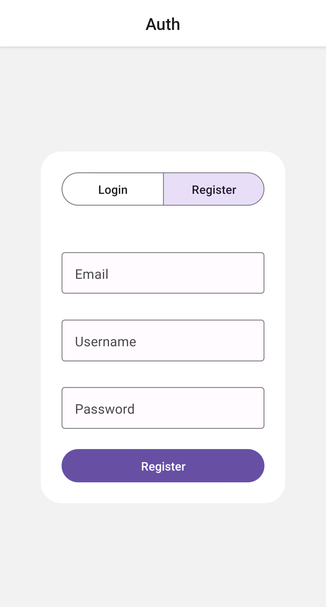
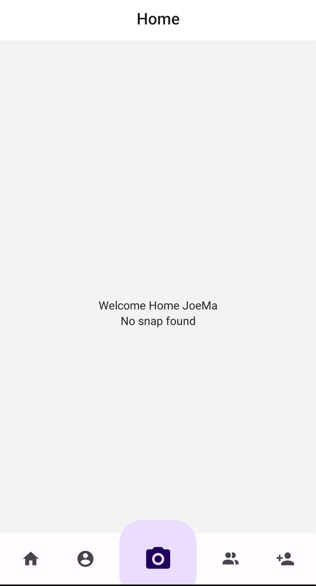
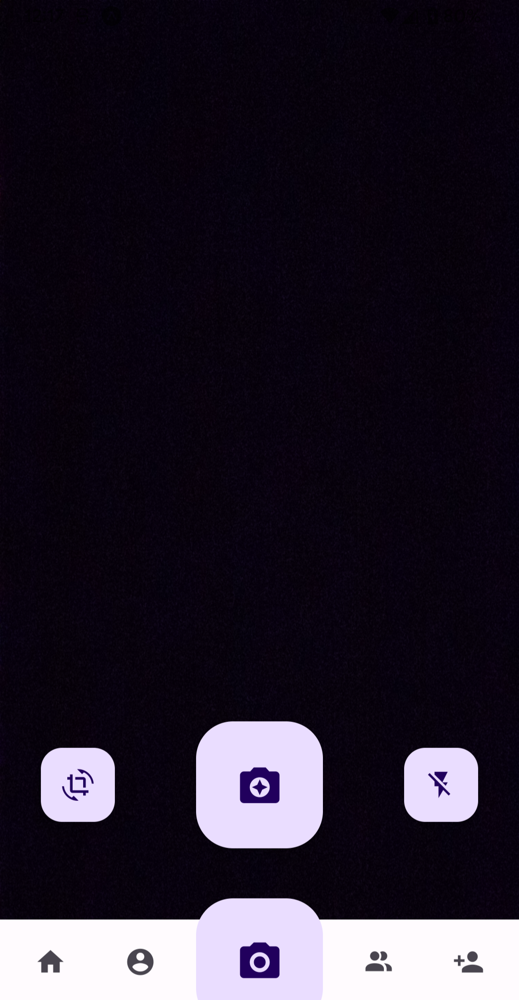
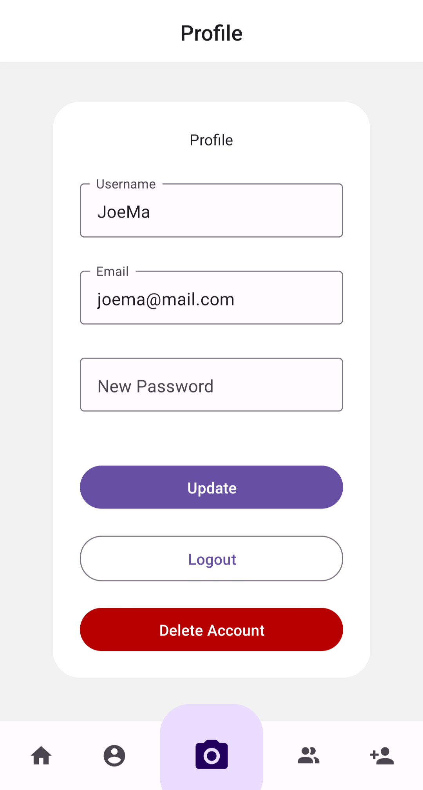

# epitech-my-snapchat

## FR

Le but de ce projet était de créer un équivalent à snapchat front seulement en utilisant une API fournie par Epitech.

Durée : 1 semaine

Technologies utilisées : React Native, Node.JS, expo

## EN

The goal of this project was to create a snapchat like front only and use an API given by Epitech.

Length : 1 week

Techcnologies used : React Native, Node.JS, expo

## Screenshots

### Authentification

### Home / Accueil

### Camera

### Profile

